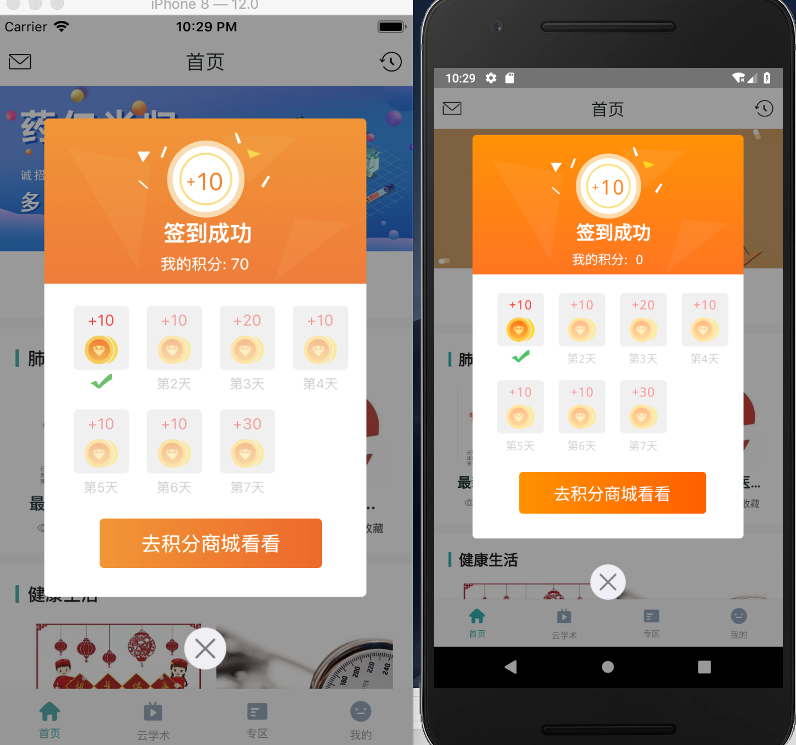
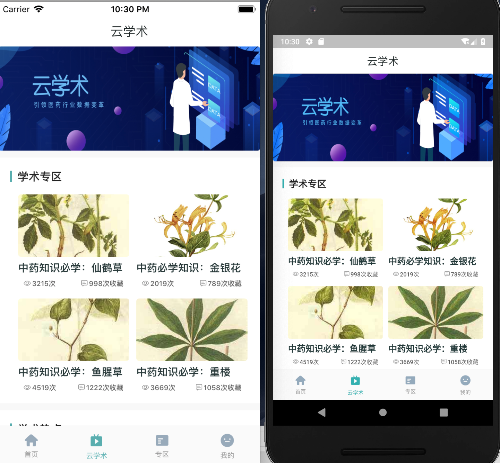
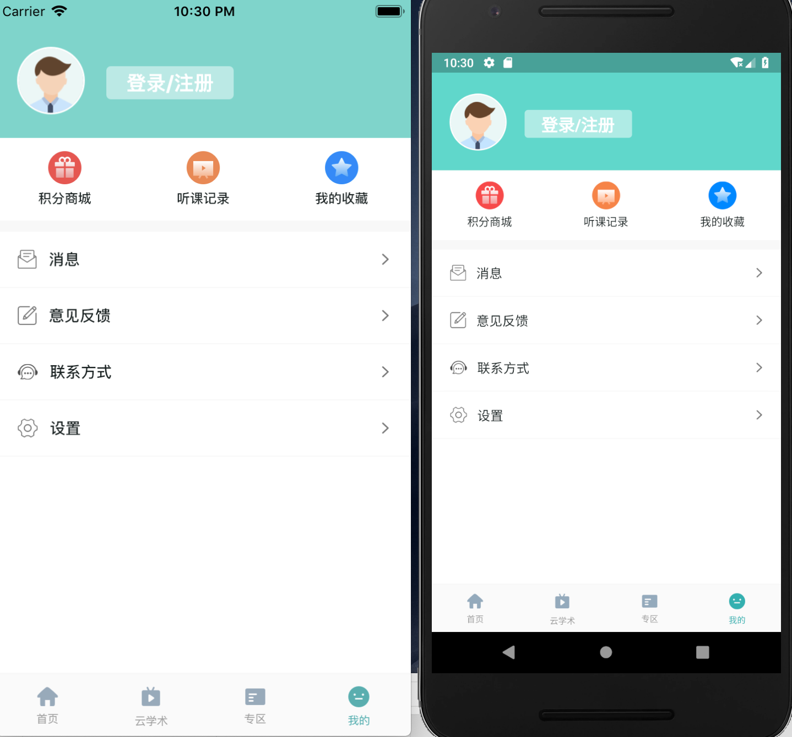

# fish-redux-demo

一个基于fish-redux的Flutter脚手架，包含基本的屏幕适配、全局toast提示、网络请求封装、路由框架集成、网络图片缓存，
实现了在fish-redux框架下fluro路由框架的集成、演示了Flutter和WebView的双向通信，实现了在fish-redux模式下的页面跳转
传参以及实现AutomaticKeepAliveClientMixin，以及实现了父组件和子组件局部数据和页面之间全局数据共享逻辑，是一个开箱即用不可多得的Flutter项目脚手架。
(出于业务安全考虑，Android和iOS原生端的加密公钥已经被抹掉请直接下载[Android release 安装包](https://github.com/bozaigao/fish-redux-demo/blob/master/app.apk)进行体验，账号:11211110085 密码:123456)

## 效果图如下

Taro适配rn、h5、微信小程序友情链接[Taro-demo](https://github.com/bozaigao/Taro-demo)